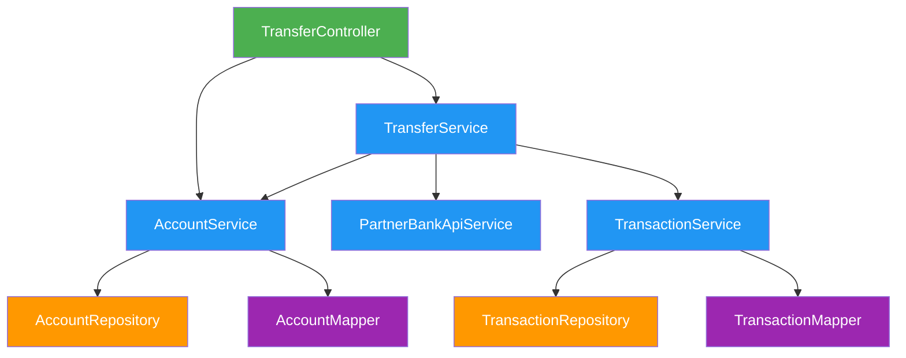

# 🔍 Hướng dẫn Debug: Ghost Transaction (Giao dịch bóng ma)

## Mục tiêu

Tìm ra **tại sao** `@Transactional` không rollback khi có Checked Exception, bằng cách đi sâu vào Source Code của Spring Framework.

---

## Architecture Overview



> 🟢 Controller → 🔵 Service Interfaces → 🟠 Repositories → 🟣 Mappers

---

## Phần 1: Tái hiện Bug

### Bước 1.1 — Kiểm tra số dư ban đầu

Mở Postman hoặc Swagger UI, gọi API:

```
GET /api/v1/transfer/balance/ACC001
```

Kết quả mong đợi:

```json
{
  "account": "ACC001",
  "owner": "Nguyen Van Admin",
  "balance": 10000000
}
```

> ✅ Xác nhận: ACC001 đang có **10,000,000 VND**.

### Bước 1.2 — Thực hiện chuyển tiền (sẽ lỗi)

```
POST /api/v1/transfer/partner?from=ACC001&to=PARTNER999&amount=5000000
```

Kết quả mong đợi:

```json
{
  "error": "Lỗi: Ngân hàng đối tác từ chối giao dịch: Tài khoản PARTNER999 không tồn tại"
}
```

> ⚠️ API trả về lỗi. Về lý thuyết, số dư phải giữ nguyên.

### Bước 1.3 — Kiểm tra lại số dư → 💀 Phát hiện Bug

```
GET /api/v1/transfer/balance/ACC001
```

Kết quả thực tế:

```json
{
  "account": "ACC001",
  "owner": "Nguyen Van Admin",
  "balance": 5000000
}
```

> 💀 **MẤT 5 TRIỆU!** Tiền đã bị trừ mà không rollback. Đây là "Ghost Transaction".

---

## Phần 2: Phân tích nghi vấn

Trước khi debug, hãy suy nghĩ:

1. Method `transferToPartnerBank` có `@Transactional` → Lẽ ra phải rollback.
2. Exception `BankTransferException` đã được ném ra → Lẽ ra transaction phải bị hủy.
3. **Giả thuyết**: Có thể Spring **không coi** `BankTransferException` là loại exception cần rollback?

---

## Phần 3: Debug Step-by-Step trong IntelliJ IDEA

### Bước 3.1 — Đặt Breakpoint đầu tiên tại `TransferService`

1. Mở file `TransferService.java`.
2. Tìm dòng gọi API đối tác:
   ```java
   partnerBankApiService.creditToPartnerBank(toPartnerAccountNumber, amount);
   ```
3. **Click vào lề trái** của dòng này để đặt Breakpoint (chấm đỏ).

> 🎯 Mục đích: Xác nhận rằng tiền đã bị trừ TRƯỚC KHI gọi API đối tác.

### Bước 3.2 — Chạy ứng dụng ở chế độ Debug

1. Nhấn nút **Debug** (hình con bọ 🐛) thay vì nút Run.
2. Gọi lại API chuyển tiền từ Postman/Swagger.
3. Chương trình sẽ dừng lại tại Breakpoint.

### Bước 3.3 — Quan sát giá trị biến

Tại bảng **Variables** (góc dưới phải), kiểm tra:

| Biến                     | Giá trị        | Ý nghĩa            |
| ------------------------ | -------------- | ------------------ |
| `fromAccount.balance`    | `5000000`      | ⚠️ Tiền ĐÃ bị trừ! |
| `amount`                 | `5000000`      | Số tiền chuyển     |
| `toPartnerAccountNumber` | `"PARTNER999"` | Tài khoản đối tác  |

> ⚠️ Tại thời điểm này, tiền đã bị trừ và `accountRepository.save()` đã chạy xong.

### Bước 3.4 — Nhấn F8 (Step Over) để đi tiếp

1. Nhấn **F8** để chạy dòng `creditToPartnerBank(...)`.
2. Method này sẽ ném ra `BankTransferException`.
3. Chương trình sẽ **nhảy ra khỏi** method `transferToPartnerBank`.

> 💡 Lúc này, nếu `@Transactional` hoạt động đúng, Spring phải rollback. Nhưng liệu nó có rollback không?

---

## Phần 4: Đi sâu vào Spring Framework Source Code

**Đây là phần quan trọng nhất — chứng minh tại sao Spring KHÔNG rollback.**

### Bước 4.1 — Tìm class `TransactionAspectSupport`

1. Nhấn **`Shift` 2 lần** (Search Everywhere).
2. Gõ: `TransactionAspectSupport`.
3. Chọn class thuộc package `org.springframework.transaction.interceptor`.

### Bước 4.2 — Tìm method `completeTransactionAfterThrowing`

1. Trong class `TransactionAspectSupport`, nhấn **`Ctrl + F12`** (File Structure).
2. Gõ: `completeTransactionAfterThrowing`.
3. Click vào method đó.

### Bước 4.3 — Đặt Breakpoint tại dòng `if`

Tìm dòng code sau và **đặt Breakpoint**:

```java
if (txInfo.transactionAttribute != null && txInfo.transactionAttribute.rollbackOn(ex)) {
```

> 🎯 Đây là dòng code quyết định: **Rollback hay Commit?**

### Bước 4.4 — Chạy lại kịch bản chuyển tiền

1. Gọi lại API chuyển tiền từ Postman.
2. Chương trình sẽ dừng tại Breakpoint trong `TransactionAspectSupport`.
3. Tại bảng **Variables**, kiểm tra:

| Biến | Giá trị                                                 |
| ---- | ------------------------------------------------------- |
| `ex` | `BankTransferException: "Ngân hàng đối tác từ chối..."` |

### Bước 4.5 — Nhấn F7 (Step Into) vào `rollbackOn(ex)`

1. Đảm bảo con trỏ đang ở dòng `if` chứa `rollbackOn(ex)`.
2. Nhấn **`F7` (Step Into)**.
3. IDE sẽ nhảy vào class **`DelegatingTransactionAttribute`**, dòng:
   ```java
   return this.targetAttribute.rollbackOn(ex);
   ```

### Bước 4.6 — Nhấn F7 lần nữa

1. Nhấn **`F7`** thêm một lần nữa.
2. IDE sẽ nhảy vào class **`RuleBasedTransactionAttribute`**.
3. Vì chúng ta KHÔNG cấu hình `rollbackFor`, method này sẽ gọi:
   ```java
   return super.rollbackOn(ex);
   ```

### Bước 4.7 — Nhấn F7 lần cuối → ĐÂY LÀ "HIỆN TRƯỜNG VỤ ÁN"

1. Nhấn **`F7`** thêm một lần nữa.
2. IDE sẽ nhảy vào class **`DefaultTransactionAttribute`**.
3. Bạn sẽ thấy dòng code "tội đồ":

```java
@Override
public boolean rollbackOn(Throwable ex) {
    return (ex instanceof RuntimeException || ex instanceof Error);
}
```

### Bước 4.8 — Kiểm chứng giá trị tại bảng Variables

Tại bảng **Variables** hoặc dùng **Evaluate Expression** (`Ctrl + Shift + Enter`):

| Biểu thức                        | Kết quả                 | Giải thích                                    |
| -------------------------------- | ----------------------- | --------------------------------------------- |
| `ex`                             | `BankTransferException` | Exception của chúng ta                        |
| `ex instanceof RuntimeException` | **`false`**             | ❌ Vì BankTransferException extends Exception |
| `ex instanceof Error`            | **`false`**             | ❌ Vì BankTransferException KHÔNG phải Error  |
| **Kết quả trả về**               | **`false`**             | → Spring sẽ **KHÔNG rollback**                |

### Bước 4.9 — Nhấn F8 để xem Spring Commit

1. Nhấn **F8** (Step Over) để quay lại `TransactionAspectSupport`.
2. Vì `rollbackOn(ex)` trả về `false`, Spring nhảy vào khối **`else`**:
   ```java
   else {
       // We don't roll back on this exception.
       txInfo.getTransactionManager().commit(txInfo.getTransactionStatus());
   }
   ```
3. **Spring gọi `commit()`** → Tiền bị trừ vĩnh viễn trong Database!

---

## Phần 5: Tóm tắt chuỗi gọi (Call Chain)

```
TransferService.transferToPartnerBank()
    ↓ throws BankTransferException (checked)
TransactionInterceptor.invoke()
    ↓ catch exception
TransactionAspectSupport.completeTransactionAfterThrowing()
    ↓ gọi rollbackOn(ex)
DelegatingTransactionAttribute.rollbackOn(ex)
    ↓ delegate
RuleBasedTransactionAttribute.rollbackOn(ex)
    ↓ không có rule nào match → gọi super
DefaultTransactionAttribute.rollbackOn(ex)
    ↓ return (ex instanceof RuntimeException || ex instanceof Error)
    ↓ = (false || false) = FALSE
    ↓
TransactionAspectSupport → else block → COMMIT! 💀
```

---

## Phần 6: Giải pháp khắc phục

### Cách 1: Thêm `rollbackFor` (Khuyến nghị)

```java
@Transactional(rollbackFor = Exception.class)
public void transferToPartnerBank(...) throws BankTransferException {
    // Code giữ nguyên
}
```

### Cách 2: Chuyển sang RuntimeException

```java
public class BankTransferException extends RuntimeException {
    // Thay Exception bằng RuntimeException
}
```

### Cách 3: Best Practice cho Banking

```java
@Transactional(
    rollbackFor = Exception.class,
    isolation = Isolation.READ_COMMITTED,
    timeout = 30
)
```

---

## Phần 7: Kiểm chứng sau khi Fix

1. Áp dụng **Cách 1** (thêm `rollbackFor`).
2. Chạy lại kịch bản chuyển tiền lỗi.
3. Kiểm tra số dư ACC001 → Phải là **10,000,000 VND** (đã rollback).
4. Debug lại: `rollbackOn(ex)` giờ sẽ trả về **`true`** vì `RuleBasedTransactionAttribute` sẽ tìm thấy rule `rollbackFor = Exception.class` và match thành công.

---

## Tổng kết kỹ năng Debug

| Kỹ năng                 | Mô tả                                                  |
| ----------------------- | ------------------------------------------------------ |
| **Breakpoint**          | Dừng chương trình tại dòng code cụ thể                 |
| **Step Over (F8)**      | Chạy qua dòng hiện tại, không đi sâu vào method        |
| **Step Into (F7)**      | Đi sâu vào bên trong method đang gọi                   |
| **Variables Panel**     | Xem giá trị biến tại thời điểm debug                   |
| **Evaluate Expression** | Tính toán biểu thức tùy ý (Ctrl+Shift+Enter)           |
| **Search Everywhere**   | Tìm class trong toàn bộ project + libraries (Shift x2) |
| **File Structure**      | Xem danh sách method trong class (Ctrl+F12)            |
