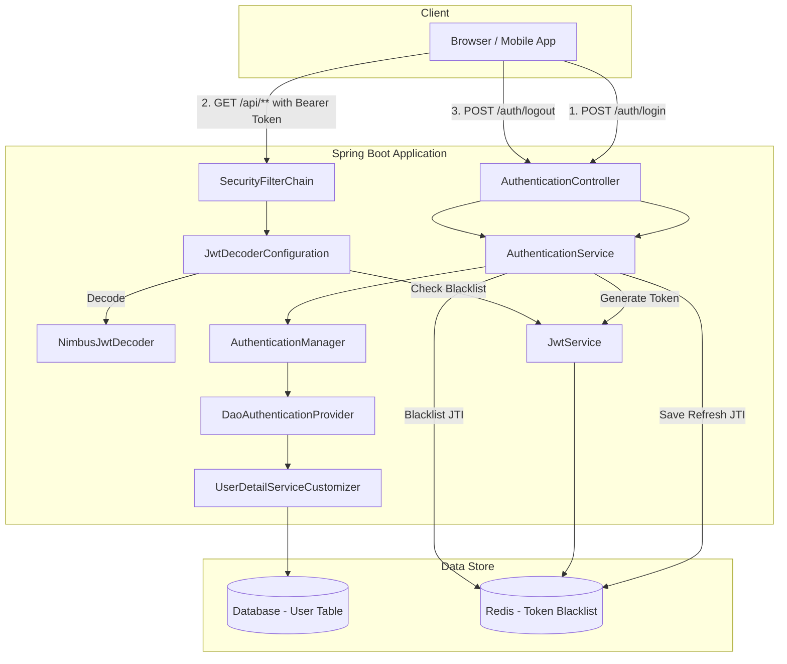
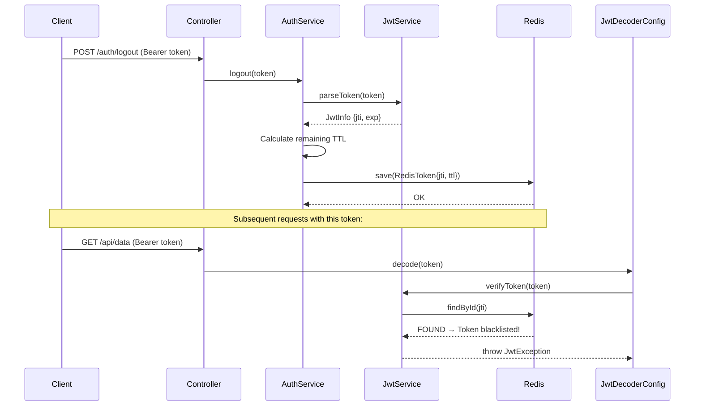

# Security Architecture Overview — OAuth2 Resource Server

## 1. Tổng quan kiến trúc (Architecture Overview)

Hệ thống sử dụng mô hình **OAuth2 Resource Server** kết hợp **Stateless Authentication** (JWT) và **Stateful Revocation** (Redis Blacklist).

### 1.1. Sơ đồ kiến trúc (Architecture Diagram)



### 1.2. Nguyên lý hoạt động (How it works)

| Bước | Mô tả (Vietnamese) | Description (English) |
|:---:|:---|:---|
| 1 | Client gửi `email` + `password` đến `/auth/login` | Client sends credentials to login endpoint |
| 2 | `AuthenticationManager` xác thực qua `DaoAuthenticationProvider` | AuthenticationManager validates via DaoAuthenticationProvider |
| 3 | `UserDetailServiceCustomizer` truy vấn DB để tìm User | UserDetailServiceCustomizer queries DB to find User |
| 4 | `JwtService` tạo **Access Token** (30 phút) và **Refresh Token** (14 ngày) | JwtService generates Access Token (30m) and Refresh Token (14d) |
| 5 | Mỗi token đều có một `jti` (JWT ID) duy nhất | Each token has a unique `jti` (JWT ID) |
| 6 | Refresh Token's `jti` được lưu vào Redis với TTL | Refresh Token's `jti` is saved to Redis with TTL |
| 7 | Client gửi request kèm `Authorization: Bearer <token>` | Client sends request with Bearer token |
| 8 | `JwtDecoderConfiguration` kiểm tra token có bị blacklist không | JwtDecoderConfiguration checks if token is blacklisted |
| 9 | Nếu hợp lệ, `NimbusJwtDecoder` decode và xác thực chữ ký | If valid, NimbusJwtDecoder decodes and verifies signature |

---

## 2. Cấu trúc package (Package Structure)

```
security/
├── configuration/
│   ├── SecurityConfiguration.java      # SecurityFilterChain + AuthenticationManager
│   ├── JwtDecoderConfiguration.java    # Custom JwtDecoder (blacklist check)
│   └── RedisConfiguration.java         # Lettuce connection factory
├── controller/
│   └── AuthenticationController.java   # Login + Logout endpoints
├── dto/
│   ├── JwtInfo.java                    # JWT metadata (jti, issuedAt, exp)
│   ├── TokenPayload.java              # Token + jti + expiredTime
│   ├── request/
│   │   ├── LoginRequest.java
│   │   └── UserCreateRequest.java
│   └── response/
│       ├── LoginResponse.java          # accessToken + refreshToken
│       └── UserCreateResponse.java
├── model/
│   ├── User.java                       # Entity implements UserDetails
│   └── RedisToken.java                 # Redis hash with TTL
├── repository/
│   ├── UserRepository.java             # JPA repository
│   └── RedisTokenRepository.java       # CrudRepository for Redis
└── service/
    ├── AuthenticationService.java       # Login + Logout business logic
    ├── JwtService.java                  # Token generation + verification
    ├── UserDetailServiceCustomizer.java # UserDetailsService implementation
    └── UserService.java                 # User CRUD
```

---

## 3. Cơ chế bảo mật chi tiết (Security Mechanisms)

### 3.1. SecurityFilterChain

```java
@Bean
public SecurityFilterChain filterChain(HttpSecurity http) throws Exception {
    http
        .csrf(AbstractHttpConfigurer::disable)                    // Stateless REST → no CSRF
        .authorizeHttpRequests(authorize -> authorize
            .requestMatchers(AUTH_WHITELIST).permitAll()           // Public endpoints
            .anyRequest().authenticated()                         // Private endpoints
        )
        .oauth2ResourceServer((oauth2) -> oauth2
            .jwt(jwtConfigurer -> jwtConfigurer
                .decoder(jwtDecoderConfiguration)));              // Custom decoder
    return http.build();
}
```

**Giải thích (Explanation):**
- **CSRF disabled**: Vì đây là REST API stateless, CSRF không cần thiết.
- **AUTH_WHITELIST**: Các endpoint `/auth/login` và `/user` được phép truy cập tự do.
- **oauth2ResourceServer**: Cho Spring Security biết đây là Resource Server, sử dụng JWT.
- **Custom Decoder**: Thay vì dùng `NimbusJwtDecoder` mặc định, ta inject `JwtDecoderConfiguration` để thêm logic kiểm tra blacklist.

### 3.2. AuthenticationManager

```java
@Bean
public AuthenticationManager authenticationManager() {
    DaoAuthenticationProvider provider = new DaoAuthenticationProvider(userDetailsService);
    provider.setPasswordEncoder(passwordEncoder());
    return new ProviderManager(provider);
}
```

**Giải thích (Explanation):**
- `DaoAuthenticationProvider`: Xác thực theo kiểu **Username & Password**.
- `PasswordEncoder`: Sử dụng `BCryptPasswordEncoder(10)` — 10 là strength mặc định.
- `ProviderManager`: Cho phép nhiều `AuthenticationProvider` (có thể mở rộng thêm OAuth2, API Key...).

### 3.3. Cơ chế Revocation (Token Blacklisting)



**Tại sao dùng TTL? (Why use TTL?)**
- Redis tự động xóa entry khi token hết hạn tự nhiên.
- Tiết kiệm bộ nhớ — không cần cron job dọn dẹp.
- Công thức: `TTL = (expirationTime - currentTime) / 1000` (giây).

---

## 4. Cấu hình (Configuration)

### 4.1. Dependencies (pom.xml)

```xml
<!-- Core: OAuth2 Resource Server -->
<dependency>
    <groupId>org.springframework.boot</groupId>
    <artifactId>spring-boot-starter-oauth2-resource-server</artifactId>
</dependency>

<!-- Redis for Token Blacklisting -->
<dependency>
    <groupId>org.springframework.boot</groupId>
    <artifactId>spring-boot-starter-data-redis</artifactId>
</dependency>
```

### 4.2. application.yaml

```yaml
spring:
  data:
    redis:
      host: localhost
      port: 6379

jwt:
  secret-key: <YOUR_512_BIT_SECRET_KEY>
  # Generate at: https://generate-random.org/encryption-key-generator
  # HS512 requires minimum 64 bytes (512 bits)
```

> [!IMPORTANT]
> Secret key phải có độ dài tối thiểu **64 bytes** (512 bits) cho thuật toán HS512.
> Không bao giờ commit secret key vào Git. Sử dụng environment variables trong production.
