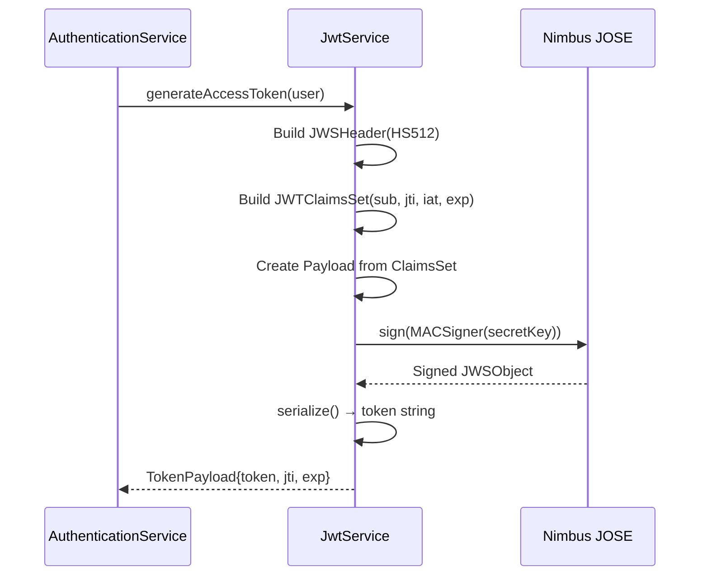
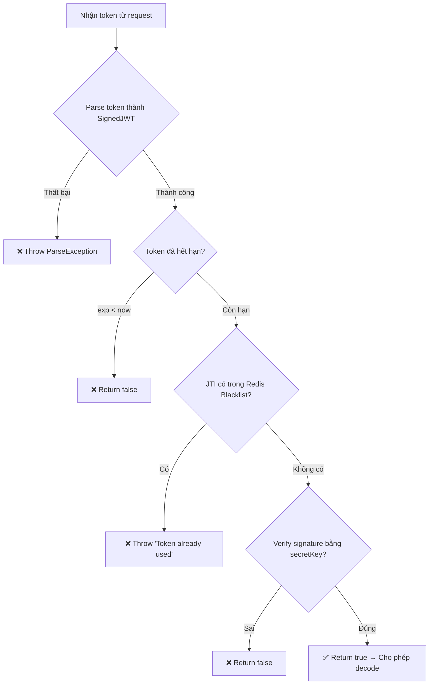

# JWT Token Management — Tạo, Xác thực, và Vô hiệu hóa Token

## 1. Cấu trúc JWT (JWT Structure)

Mỗi JWT gồm 3 phần: **Header**, **Payload**, và **Signature**.

```
eyJhbGciOiJIUzUxMiJ9.eyJzdWIiOiJ1c2VyQGVtYWlsLmNvbSIsImp0aSI6IjEyMzQ1Njc4IiwiaWF0IjoxNzE0MDAwMDAwLCJleHAiOjE3MTQwMDE4MDB9.SIGNATURE
|_____Header_____|.________________________Payload__________________________.___SIGN____|
```

| Phần          | Nội dung                          | Mục đích                         |
| :------------ | :-------------------------------- | :------------------------------- |
| **Header**    | `{"alg": "HS512"}`                | Thuật toán mã hóa: HMAC-SHA512   |
| **Payload**   | `sub`, `jti`, `iat`, `exp`        | Thông tin người dùng và metadata |
| **Signature** | HMAC(header + payload, secretKey) | Đảm bảo tính toàn vẹn dữ liệu    |

### Payload Claims chi tiết

| Claim | Ý nghĩa (Vietnamese)  | Meaning (English)       | Ví dụ                                  |
| :---- | :-------------------- | :---------------------- | :------------------------------------- |
| `sub` | Email người dùng      | User's email (Subject)  | `user@example.com`                     |
| `jti` | ID duy nhất của token | Unique token identifier | `550e8400-e29b-41d4-a716-446655440000` |
| `iat` | Thời gian tạo token   | Token issue time        | `2025-04-25T10:00:00Z`                 |
| `exp` | Thời gian hết hạn     | Token expiration time   | `2025-04-25T10:30:00Z`                 |

---

## 2. Token Generation (Tạo Token)

### 2.1. Luồng tạo token (Generation Flow)



### 2.2. Code Reference

```java
private TokenPayload generateToken(User user, long duration, ChronoUnit unit) {
    // 1. Header: Chọn thuật toán HS512
    JWSHeader header = new JWSHeader(JWSAlgorithm.HS512);

    // 2. Tính toán thời gian
    Date issueTime = new Date();
    Date expirationTime = Date.from(issueTime.toInstant().plus(duration, unit));
    String jwtID = UUID.randomUUID().toString();  // JTI duy nhất

    // 3. Payload: Claims chứa thông tin user
    JWTClaimsSet claimsSet = new JWTClaimsSet.Builder()
            .subject(user.getEmail())       // sub = email
            .jwtID(jwtID)                   // jti = unique ID
            .issueTime(issueTime)           // iat
            .expirationTime(expirationTime) // exp
            .build();

    // 4. Signature: Ký bằng secretKey
    JWSObject jwsObject = new JWSObject(header, new Payload(claimsSet.toJSONObject()));
    jwsObject.sign(new MACSigner(secretKey));

    // 5. Serialize: Tạo chuỗi token
    return TokenPayload.builder()
            .token(jwsObject.serialize())
            .jwtID(jwtID)
            .expiredTime(expirationTime)
            .build();
}
```

### 2.3. Token Lifetimes

| Loại Token        | Thời gian sống | Mục đích               |
| :---------------- | :------------- | :--------------------- |
| **Access Token**  | 30 phút        | Truy cập API resources |
| **Refresh Token** | 14 ngày        | Lấy Access Token mới   |

---

## 3. Token Verification (Xác thực Token)

### 3.1. Luồng xác thực (Verification Flow)



### 3.2. Code Reference

```java
public boolean verifyToken(String token) throws ParseException, JOSEException {
    SignedJWT signedJWT = SignedJWT.parse(token);

    // Step 1: Kiểm tra hết hạn
    Date expirationTime = signedJWT.getJWTClaimsSet().getExpirationTime();
    if (expirationTime.before(new Date())) {
        return false;  // Token đã hết hạn
    }

    // Step 2: Kiểm tra blacklist (Redis)
    String jwtID = signedJWT.getJWTClaimsSet().getJWTID();
    redisTokenRepository.findById(jwtID).ifPresent(redisToken -> {
        throw new RuntimeException("Token already used");
    });

    // Step 3: Verify chữ ký
    return signedJWT.verify(new MACVerifier(secretKey));
}
```

> [!IMPORTANT]
> **Thứ tự kiểm tra rất quan trọng:**
>
> 1. Kiểm tra **hết hạn** trước (tránh truy vấn Redis không cần thiết)
> 2. Kiểm tra **blacklist** (Redis lookup)
> 3. **Verify signature** cuối cùng (tốn CPU nhất)

---

## 4. Token Revocation (Vô hiệu hóa Token)

### 4.1. Cơ chế Blacklisting

Khi user logout, hệ thống lưu `jti` của token vào Redis với TTL = thời gian còn lại của token.

```java
public void logout(String token) {
    JwtInfo jwtInfo = jwtService.parseToken(token);
    String jwtID = jwtInfo.getJwtID();
    Date expirationTime = jwtInfo.getExpirationTime();
    Date currentTime = new Date();

    // Skip nếu token đã hết hạn
    if (expirationTime.before(currentTime)) return;

    // Skip nếu token đã bị logout
    if (redisTokenRepository.existsById(jwtID)) return;

    // Tính TTL còn lại (giây)
    long timeToExpireInSeconds = (expirationTime.getTime() - currentTime.getTime()) / 1000;

    // Lưu vào Redis với TTL
    redisTokenRepository.save(RedisToken.builder()
            .jwtID(jwtID)
            .expiredTime(timeToExpireInSeconds)
            .build());
}
```

### 4.2. Redis Model

```java
@RedisHash("RedisHas")
public class RedisToken {
    @Id
    private String jwtID;          // JTI làm key

    @TimeToLive(unit = TimeUnit.SECONDS)
    private Long expiredTime;       // Redis tự xóa khi hết TTL
}
```

### 4.3. Tại sao dùng Redis? (Why Redis?)

| Tiêu chí        | Redis                      | Database              |
| :-------------- | :------------------------- | :-------------------- |
| **Tốc độ**      | O(1) lookup                | O(log N) với index    |
| **TTL tự động** | ✅ Built-in                | ❌ Phải dùng cron job |
| **Memory**      | Chỉ lưu token chưa hết hạn | Tích lũy vĩnh viễn    |
| **Phù hợp**     | Token blacklist            | Dữ liệu lâu dài       |

> [!NOTE]
> **Trade-off:** Redis là in-memory storage. Nếu Redis restart, tất cả blacklisted tokens sẽ bị mất.
> Trong production, nên cấu hình Redis persistence (AOF/RDB) hoặc dùng Redis Cluster.

---

## 5. Custom JwtDecoder (Điểm mấu chốt)

Đây là pattern quan trọng nhất — hook vào Spring Security filter chain để kiểm tra blacklist **trước khi** decode token.

```java
@Component
public class JwtDecoderConfiguration implements JwtDecoder {

    private final JwtService jwtService;
    private NimbusJwtDecoder nimbusJwtDecoder = null;  // Lazy initialization

    @Override
    public Jwt decode(String token) throws JwtException {
        // Step 1: Kiểm tra blacklist + expiration + signature
        if (!jwtService.verifyToken(token)) {
            throw new JwtException("Invalid token");
        }

        // Step 2: Lazy init NimbusJwtDecoder (chỉ tạo 1 lần)
        if (Objects.isNull(nimbusJwtDecoder)) {
            SecretKey secretKeySpec = new SecretKeySpec(
                secretKey.getBytes(StandardCharsets.UTF_8), "HS512"
            );
            nimbusJwtDecoder = NimbusJwtDecoder.withSecretKey(secretKeySpec)
                    .macAlgorithm(MacAlgorithm.HS512)
                    .build();
        }

        // Step 3: Decode token thành Jwt object cho Spring Security
        return nimbusJwtDecoder.decode(token);
    }
}
```

> [!WARNING]
> **Điểm cần chú ý:** Token đang bị verify **2 lần** (1 lần trong `verifyToken`, 1 lần trong `nimbusJwtDecoder.decode`).
> Đây là trade-off có chủ đích: lần đầu kiểm tra nghiệp vụ (blacklist), lần sau là decode chính thức của Spring Security.
